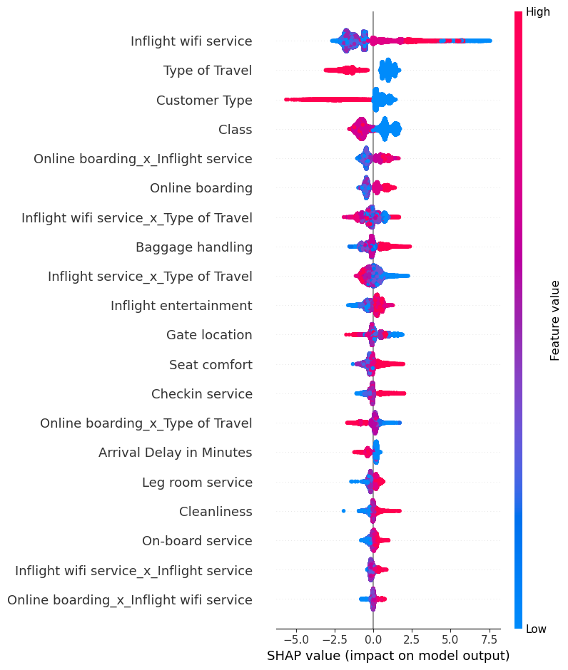
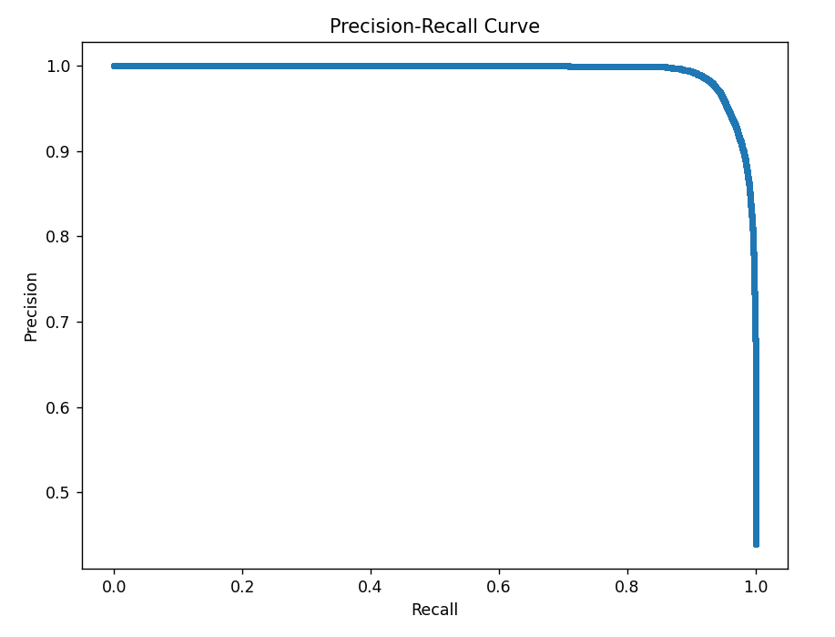
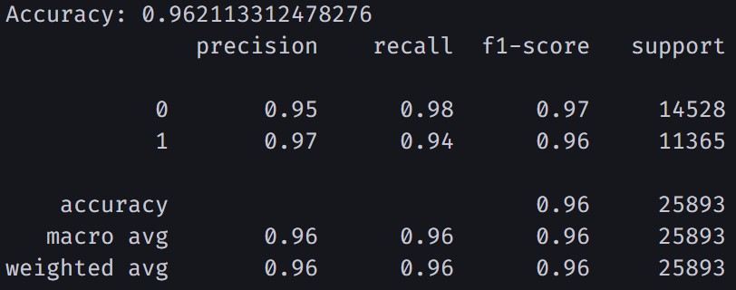

Based on your conda environment and project structure, here's an updated README.md:

```markdown
# Airline Customer Satisfaction Prediction

## Project Overview
This project develops a machine learning model to predict customer satisfaction in airlines using advanced techniques like LightGBM and Optuna for hyperparameter optimization.

## Features
- Advanced Machine Learning Modeling
- Hyperparameter Tuning with Optuna
- Comprehensive Performance Evaluation
- Feature Importance Visualization using SHAP
- Precision-Recall Curve Analysis

## Dataset
### Data Description
- Source: [Kaggle Airlines CSR Dataset](https://www.kaggle.com/datasets/rafiquzzamanrafi/airlines-csr)
- Target Variable: satisfaction
- Features: 
  - Arrival Delay in Minutes
  - Departure Delay in Minutes
  - Flight Distance
  - Age
  - Inflight wifi service
  - Type of travel
  - And more...

### Data Preprocessing
- Stratified Train-Test Split
- Standard Scaling
- Handling Class Imbalance
- Column Transformation using Yeo-Johnson method

## Technologies Used
- Python 3.12
- Conda Environment
- Libraries:
  - scikit-learn
  - LightGBM
  - Optuna
  - Pandas
  - NumPy
  - Matplotlib
  - SHAP

## Model Techniques
- LightGBM Classifier
- Stratified K-Fold Cross-Validation
- Hyperparameter Optimization
- Balanced Accuracy Scoring

## Performance Metrics
- Accuracy
- ROC AUC Score
- Average Precision
- Classification Report
- Precision-Recall Curve

## Project Structure
```
```
Customer-Satisfaction-Rating/
│
├── data/
│   └── train.csv
│   └── test.csv   
│
├── notebooks/
│   └── CSR.ipynb
│
├── models/
│   └── cat_model.pkl
│
├── conda_environment.yml
├── README.md
└── main.py
```

## Environment Setup

### Option 1: Conda Environment
1. Install Anaconda or Miniconda
2. Clone the repository
```bash
git clone https://github.com/RRafi89/Customer-Satisfaction-Rating.git
cd Customer-Satisfaction-Rating
```

3. Create and activate conda environment
```bash
conda env create -f conda_environment.yml
conda activate base  # or your environment name
```

### Option 2: Manual Installation
```bash | terminal
pip install lightgbm optuna scikit-learn pandas numpy matplotlib shap joblib
```

## Running the Project

### Data Preparation
1. Ensure dataset is in `data/` directory
2. Update data loading paths in scripts if necessary

### Execute the Model
```bash
python main.py
```

## Hyperparameter Optimization
- Optuna-driven hyperparameter search
- Optimizes:
  - Learning Rate
  - Tree Depth
  - Regularization Parameters
  - Iterations

## Visualization
- SHAP Feature Importance
- Precision-Recall Curve
- Performance Metrics Visualization

## Model Evaluation
Provides comprehensive metrics:
- Balanced Accuracy
- ROC AUC Score
- Precision and Recall
- Detailed Classification Report

## Future Improvements
- Ensemble method integration
- Advanced feature engineering
- Sophisticated regularization techniques
- Algorithm exploration

## Contributing
1. Fork the repository
2. Create feature branch
3. Commit changes
4. Push to branch
5. Open Pull Request

## Limitations
- Model performance depends on data quality
- Requires balanced dataset
- Potential training data bias

## License
MIT License

## 📞 Contact
Rafiquzzaman Rafi - rafiquzzamanrafi100@gmail.com

Project Link: https://github.com/RRafi89/Customer-Satisfaction-Rating


Some Screenshots:



